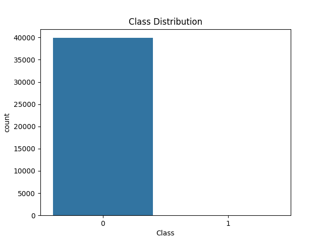
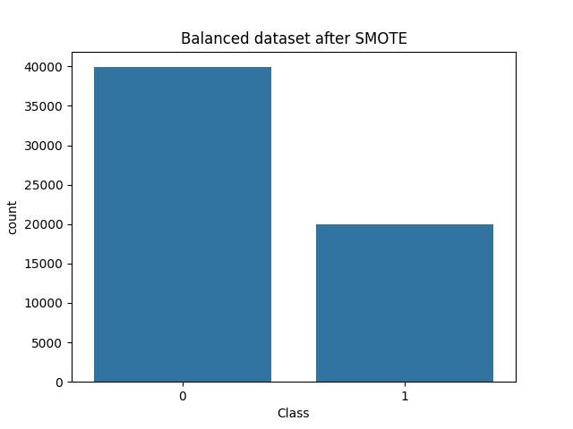
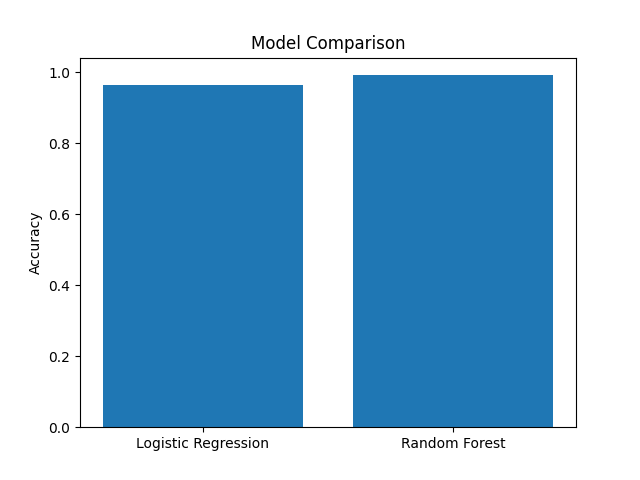

# 💳 Credit Card Fraud Detection using Machine Learning

---

## 📌 Overview

Credit card fraud is a critical financial problem where even a small percentage of fraudulent transactions can lead to significant losses.

This project builds a **machine learning-based fraud detection system** that identifies suspicious transactions while handling **highly imbalanced data**, where fraudulent cases are extremely rare.

---

## 🎯 Problem Statement

Traditional classification models struggle with fraud detection due to:

* Severe class imbalance (fraud ≪ normal transactions)
* High cost of false negatives (missed fraud cases)

👉 The goal is to build a model that **maximizes fraud detection (recall)** while maintaining overall performance.

---

## 🚀 Key Highlights

* Handles imbalanced dataset using **SMOTE**
* Implements **end-to-end ML pipeline**
* Compares **Logistic Regression vs Random Forest**
* Focuses on **recall over accuracy**
* Achieves ~99% accuracy with strong recall performance

---

## 🧠 Machine Learning Pipeline

1. **Data Preprocessing**

   * Handling missing values (if any)
   * Feature scaling (standardization)

2. **Exploratory Data Analysis (EDA)**

   * Class imbalance visualization
   * Transaction amount distribution
   * Correlation analysis

3. **Handling Imbalance**

   * Applied **SMOTE** to generate synthetic fraud samples

4. **Model Training**

   * Logistic Regression (baseline)
   * Random Forest (ensemble model)

5. **Evaluation**

   * Accuracy
   * Recall (primary focus)
   * Confusion Matrix

---

## 📊 Dataset

* Source: https://www.kaggle.com/datasets/mlg-ulb/creditcardfraud
* Contains anonymized features (V1–V28) using PCA
* Target:

  * 0 → Normal
  * 1 → Fraud

---

## 📁 Project Structure

<pre>
credit-card-fraud-detection-ml/
│
├── src/
│   └── fraud_detection.py
│
├── output/
│   ├── class_distribution.png
│   ├── amount_distribution.png
│   ├── correlation_heatmap.png
│   ├── balanced_data.png
│   └── model_comparison.png
│
├── report/
│   ├── Project_Report.docx
│   └── presentation.pptx
│
├── requirements.txt
└── README.md
</pre>

---

## ⚙️ How to Run

```bash
pip install -r requirements.txt
python src/fraud_detection.py
```

---

## 📸 Output Visualizations

### Class Distribution



### SMOTE Balanced Data



### Model Comparison



---

## 📊 Results

| Model               | Accuracy | Recall |
| ------------------- | -------- | ------ |
| Logistic Regression | ~96%     | ~0.93  |
| Random Forest       | ~99%     | ~0.98  |

---

## 🔍 Key Insight

In fraud detection systems, **Recall is more important than Accuracy**, because:

> Missing a fraudulent transaction (false negative) can result in direct financial loss.

This project prioritizes detecting fraud effectively, even at the cost of slightly lower precision.

---

## 📌 Key Learnings

* Handling imbalanced datasets using SMOTE
* Importance of evaluation metrics beyond accuracy
* End-to-end ML workflow implementation
* Model comparison and performance analysis

---

## 🔮 Future Improvements

* Real-time fraud detection system
* Deployment using Flask / Streamlit
* Advanced models (XGBoost, Deep Learning)
* Anomaly detection techniques

---

## 👨‍💻 Author

**Priyank Sinha**
B.Tech CSE | UPES

GitHub: https://github.com/Priyank-14

---

## ⭐ Note

This project demonstrates practical implementation of machine learning techniques for solving real-world fraud detection problems.
